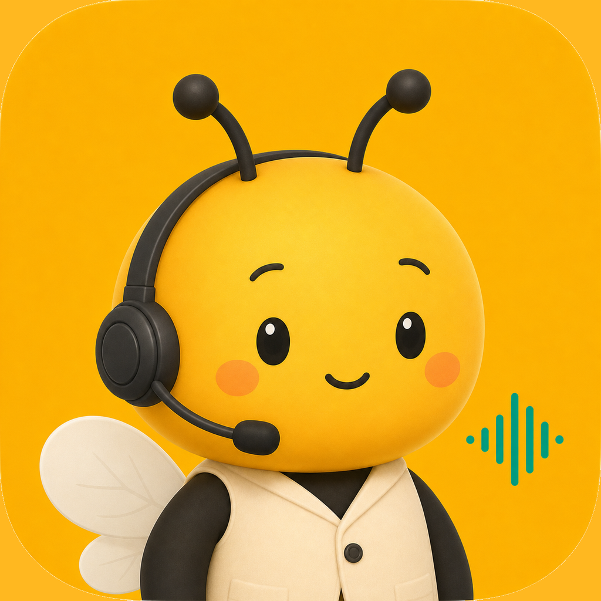

<p align="center">
  
</p>

<h1 align="center">콜비(Callbee) — 사장님 대신 전화 받는 AI 상담원</h1>

온·오프라인 사업장의 전화 고객센터를 AI가 대신 받아주는 멀티테넌트 플랫폼.
070 인바운드 → 의도분류 → (KB 응답 / 티켓 / 콜백 / 호전환) → 카카오 알림톡.
BoBi(보험설계사 SaaS) 고객센터는 이 플랫폼의 **테넌트 #1** 로 운영된다(프로젝트 코드네임: Colli-BoBi).

> 프로젝트 규칙·가드레일은 [`CLAUDE.md`](./CLAUDE.md), Worker 착수 계약은 [`docs/worker-contracts.md`](./docs/worker-contracts.md) 참조.

## 구조 (pnpm 모노레포)

| 위치 | 패키지 | 설명 | 상태 |
|---|---|---|---|
| `packages/contracts` | `@colli/contracts` | 공유 계약(단일 소스) | ✅ |
| `packages/db` | `@colli/db` | Prisma 스키마 + 클라이언트 | ✅ |
| `packages/dialogue` | `@colli/dialogue` | 대화 정책·system prompt 합성 | ✅ |
| `apps/console` | `@colli/console` | **메인 진입점** — 랜딩/가입/사업장 콘솔 + `/admin` 총괄관리자(platform_admin 로그인 시) | ✅ |
| `apps/api` | `@colli/api` | NestJS tools/테넌트/인증 API | ✅ |
| `apps/voice` | `@colli/voice` | ClawOps 인바운드 세션 핸들러 | ✅ |
| `apps/admin` | `@colli/admin` | ⚠️ deprecated — 콘솔 `/admin` 으로 통합(배포 불필요) | 🗄 |
| `services/notifications` | `@colli/notifications` | 카카오 알림톡 어댑터 | ✅ |
| `services/compliance` | `@colli/compliance` | 고지·동의·PII 가드 | ✅ |

## 개발 환경

- Node ≥ 22, pnpm 10

```bash
cd /Users/seungsoohan/Projects/CallBee
cp .env.example .env          # 값 채우기 (ClawOps/OpenAI/Kakao/BoBi/PII 키)
pnpm install
pnpm db:generate              # Prisma 클라이언트 생성
pnpm build                    # 전체 빌드
```

로컬 PostgreSQL 준비 후 최초 마이그레이션:

```bash
cd /Users/seungsoohan/Projects/CallBee
pnpm --filter @colli/db exec prisma migrate dev --name init
```

## 다음 단계

`docs/worker-contracts.md` 의 Worker A~F 를 병렬 세션/서브에이전트로 dispatch → 통합 체크포인트 → 파일럿.
